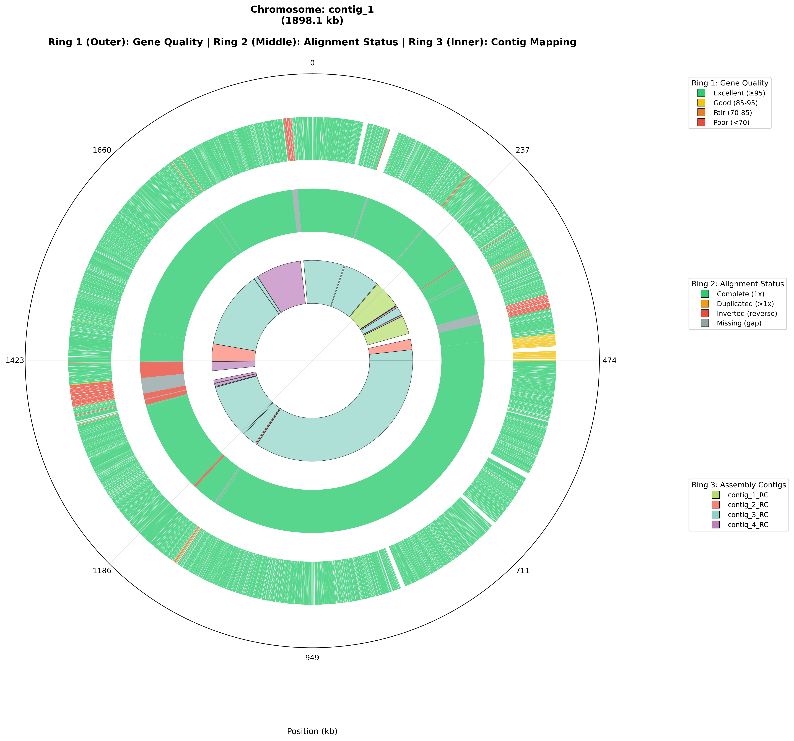
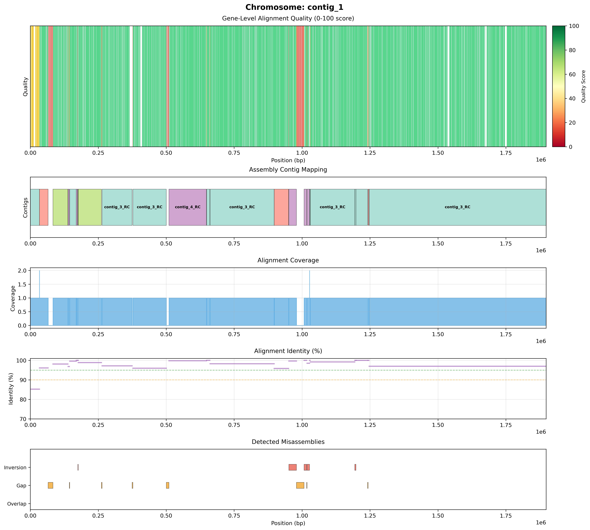

# GenomeViz

<p align="center">
  
  
  
</p>

**GenomeViz** is a comprehensive tool for visualizing and comparing bacterial genome assemblies against reference sequences. It creates beautiful circular and linear plots (both static and interactive) with comprehensive multi-track visualizations showing gene quality, alignment status, contig mapping, coverage depth, and misassemblies.

## ✨ Features

### Visualization Examples

<p align="center">
  
  <br>
  <em>Circular visualization showing three information rings</em>
</p>

<p align="center">
  
  <br>
  <em>Linear visualization with five comprehensive tracks</em>
</p>

### Three-Ring Visualization System (Circular Plots)

- **Ring 1 (Outer)**: Gene quality assessment
  - Color-coded by quality score (excellent/good/fair/poor)
  - Shows gene coverage and identity

- **Ring 2 (Middle)**: Alignment status
  - 🟢 Green: Complete coverage (1x)
  - 🟠 Orange: Duplicated regions (>1x)
  - 🔴 Red: Inverted regions (reverse strand)
  - ⚪ Gray: Missing regions (gaps)

- **Ring 3 (Inner)**: Contig mapping
  - Each contig has a unique color
  - Shows which assembly contigs align to reference

### Five-Track Visualization System (Linear Plots)

- **Track 1**: Gene quality with color-coded scores
- **Track 2**: Contig mapping showing assembly alignment
- **Track 3**: Coverage depth across the genome
- **Track 4**: Alignment identity with reference lines
- **Track 5**: Misassemblies (inversions, gaps, overlaps)

### Interactive Plots

#### Interactive Circular Plot
- **Zoom and pan** on any region
- **Hover information** for:
  - Gene names, positions, and quality scores
  - Contig names, positions, and identities
  - Alignment status and coverage
- **Export** as high-resolution images

#### Interactive Linear Plot (NEW in v1.1.0)
- **Multi-level zoom** from genome to nucleotide resolution
  - Genome level: Complete overview with all tracks
  - Gene level: Individual gene annotations visible
  - Nucleotide level: Sequence differences, SNPs, indels
- **Five comprehensive tracks**:
  - Gene quality (color-coded scores)
  - Contig mapping (assembly alignment)
  - Coverage depth (read/contig coverage)
  - Alignment identity (with reference lines)
  - Misassemblies (inversions, gaps, overlaps)
- **Range slider** for quick genome navigation
- **Smooth scroll zoom** and **click-drag pan**
- **Interactive hover** with detailed information at all levels
- **Export** to high-resolution PNG

### Additional Features

- ✅ Automatic contig orientation detection
- ✅ Static matplotlib plots for publication
- ✅ Linear plots for detailed analysis (static and interactive)
- ✅ **Clickable genes** - Click genes in interactive plots to view detailed alignment information
- ✅ **Help buttons** - Built-in help system in all interactive HTML plots
- ✅ Gene-level quality statistics (CSV export)
- ✅ Detection of gaps, inversions, and duplications
- ✅ Support for multiple sequences (chromosome + plasmids)
- ✅ **Organized output** - Separate directories per sequence with all associated files
- ✅ **Modular architecture** - Clean, maintainable codebase with separate visualizer modules
- ✅ Performance-optimized for large genomes

## 🚀 Quick Start

### Installation

```bash
# Clone the repository
git clone https://github.com/Aaron-Thiel/GenomeViz.git
cd GenomeViz

# Install dependencies
pip install -r requirements.txt
```

### Basic Usage

```bash
python genomeViz.py \
  --reference examples/input/reference.fna \
  --assembly examples/input/sample.fna \
  --gff examples/input/reference.gff3 \
  --output results/
```

### Output Files

The tool generates organized output with separate directories per sequence:

```
results/
├── contig_1/                                  # Directory for first sequence
│   ├── contig_1_circular.png                 # Static circular plot
│   ├── contig_1_interactive_circular.html    # Interactive circular plot (zoom/hover/click)
│   ├── contig_1_linear.png                   # Static linear multi-track plot
│   ├── contig_1_interactive_linear.html      # Interactive linear plot with multi-level zoom
│   ├── contig_1_gene_stats.csv               # Per-gene quality statistics
│   └── gene_alignments/                      # Detailed gene alignment HTMLs (for clicking)
│       ├── gene_001.html
│       ├── gene_002.html
│       └── ...
├── contig_2/                                  # Directory for second sequence (if multiple)
│   └── (similar structure)
├── contig_mapping.json                        # Detailed contig alignment data
└── summary_report.txt                         # Overall summary report
```

**Note**: Gene alignment files are generated by default and enable the clickable gene feature in interactive plots. Use `--no-gene-alignments` to skip generation if not needed.

## 📖 Detailed Documentation

### Command-Line Options

#### Required Arguments

- `--reference`: Reference genome in FASTA format
- `--assembly`: Assembly to compare in FASTA format
- `--gff`: Gene annotations in GFF3 format
- `--output`: Output directory for results

#### Optional Arguments

- `--preset`: Minimap2 alignment preset
  - `asm5`: More sensitive (>99% similar sequences)
  - `asm10`: Default, balanced (recommended)
  - `asm20`: Faster, less sensitive

- `--min-gap`: Minimum gap size to report (default: 1000 bp)
- `--min-inversion`: Minimum inversion size to report (default: 500 bp)
- `--no-auto-orient`: Skip automatic orientation detection
- `--no-circular`: Skip circular plot generation
- `--no-linear`: Skip static linear plot generation
- `--no-interactive`: Skip interactive circular plot generation
- `--no-interactive-linear`: Skip interactive linear plot generation
- `--no-gene-alignments`: Skip gene alignment file generation (disables gene clicking feature)

### Understanding the Visualizations

#### Circular Plots

The circular plots provide a genome-wide overview:

1. **Gene Quality (Ring 1)**:
   - **Green** (Excellent): ≥95% quality
   - **Yellow** (Good): 85-95% quality
   - **Orange** (Fair): 70-85% quality
   - **Red** (Poor): <70% quality

2. **Alignment Status (Ring 2)**:
   - **Green**: Normal 1x coverage, correctly oriented
   - **Orange**: Duplicated regions (>1x coverage)
   - **Red**: Inverted contigs (need reverse complement)
   - **Gray**: Missing sequence (gaps in assembly)

3. **Contig Mapping (Ring 3)**:
   - Each color represents a different assembly contig
   - Shows which contigs align to each region

#### Static Linear Plots

Static linear plots show five tracks:
1. Gene-level quality
2. Coverage depth
3. Sequence identity
4. Alignment strand
5. Contig mapping

These are useful for detailed analysis of specific regions and publication figures.

#### Interactive Linear Plots (NEW in v1.1.0)

The interactive linear plots provide multi-level exploration:

**At Genome Level**:
- View entire genome in linear format
- All five tracks visible simultaneously
- Quick overview of assembly quality
- Use range slider to jump to any position

**At Gene Level** (zoom in):
- Individual genes become visible as colored blocks
- Gene names and boundaries appear
- Hover to see gene details (name, quality, coverage, identity)
- Identify problematic genes instantly

**At Nucleotide Level** (zoom in further):
- See sequence-level alignment details
- Nucleotide differences become visible
- Identify SNPs, insertions, deletions
- Compare reference vs assembly sequences directly

**Interactive Controls**:
- **Scroll** to zoom in/out smoothly
- **Drag** to pan along the genome
- **Range slider** at bottom for quick navigation
- **Hover** for context-specific information
- **Legend** to toggle tracks on/off
- **Camera icon** to export high-resolution PNG

#### Interactive Circular Plots

The interactive circular plots allow you to:
- **Zoom** by scrolling or dragging
- **Pan** by clicking and dragging
- **Hover** to see detailed information
- **Toggle** individual traces on/off
- **Export** as PNG images

### Interpreting Results

#### Quality Scores

Each gene receives a quality score (0-100) based on:
- **Coverage (30% weight)**: Percentage of gene covered by assembly
- **Identity (70% weight)**: Average sequence identity in covered regions

#### Gene Status Categories

- **Complete**: ≥95% coverage AND ≥90% identity
- **Incomplete**: 50-95% coverage
- **Divergent**: <90% identity (may indicate gene variation)
- **Missing**: <50% coverage (likely absent from assembly)

#### Common Patterns

**Pattern 1: High-Quality Assembly**
```
Ring 1: Mostly green (excellent gene quality)
Ring 2: Mostly green (complete coverage)
Ring 3: Few colors (assembled into few contigs)
```

**Pattern 2: Fragmented Assembly**
```
Ring 1: Mix of colors with gaps
Ring 2: Green + gray segments (gaps present)
Ring 3: Many colors (many small contigs)
```

**Pattern 3: Misassembled Regions**
```
Ring 1: Good overall
Ring 2: Red segments (inversions)
Ring 3: Some contigs in unusual positions
```

## 🔧 Advanced Usage

### Using the Interactive Linear Plot

The interactive linear plot (v1.1.0+) is perfect for detailed genome exploration:

```bash
# Generate all plots including interactive linear
python genomeViz.py \
  --reference ref.fna \
  --assembly asm.fna \
  --gff genes.gff3 \
  --output results/
```

The output file `{seqid}_interactive_linear.html` can be opened in any browser.

**Tips for exploration**:
- Start at genome level to identify problem regions
- Zoom into genes of interest by scrolling
- Use the range slider to quickly jump between regions
- Toggle tracks on/off to focus on specific data
- Export views at different zoom levels for figures

**Skip if not needed**:
```bash
python genomeViz.py ... --no-interactive-linear
```

### Adjusting Detection Thresholds

For small plasmids (<100 kb):
```bash
python genomeViz.py \
  --reference plasmid.fna \
  --assembly assembly.fna \
  --gff plasmid.gff3 \
  --output results/ \
  --min-gap 500 \
  --min-inversion 200
```

### Disabling Auto-Orientation

To see original contig orientations:
```bash
python genomeViz.py \
  --reference ref.fna \
  --assembly asm.fna \
  --gff genes.gff3 \
  --output results/ \
  --no-auto-orient
```

### Publication-Ready Plots Only

Skip interactive HTML generation:
```bash
python genomeViz.py \
  --reference ref.fna \
  --assembly asm.fna \
  --gff genes.gff3 \
  --output results/ \
  --no-interactive
```

## 📊 Example Data

The repository includes example bacterial genome data:

- **Reference**: ~1.9 Mbp circular chromosome
- **Assembly**: 4-contig draft assembly
- **Annotations**: Bakta-annotated GFF3 file

Run the example:
```bash
python genomeViz.py \
  --reference examples/input/reference.fna \
  --assembly examples/input/sample.fna \
  --gff examples/input/reference.gff3 \
  --output examples/output/
```

## 🤝 Contributing

Contributions are welcome! Please feel free to submit a Pull Request.

## 📝 Citation

If you use GenomeViz in your research, please cite:

```
This Github Page
```

## 📄 License

This project is licensed under the MIT License - see the [LICENSE](LICENSE) file for details.

## 🐛 Issues and Support

If you encounter any problems or have suggestions, please [open an issue](https://github.com/Aaron-Thiel/GenomeViz/issues).

## 📚 Dependencies

GenomeViz relies on these excellent tools:
- [minimap2/mappy](https://github.com/lh3/minimap2) - Fast sequence alignment
- [BioPython](https://biopython.org/) - Biological sequence handling
- [matplotlib](https://matplotlib.org/) - Static plotting
- [Plotly](https://plotly.com/python/) - Interactive plotting
- [NumPy](https://numpy.org/) & [Pandas](https://pandas.pydata.org/) - Data processing

## 🙏 Acknowledgments

GenomeViz was developed to make genome assembly visualization accessible to both bioinformaticians and lab biologists. Special thanks to the developers of the underlying tools that make this possible.

---

**Made with ❤️ for the genomics community**
