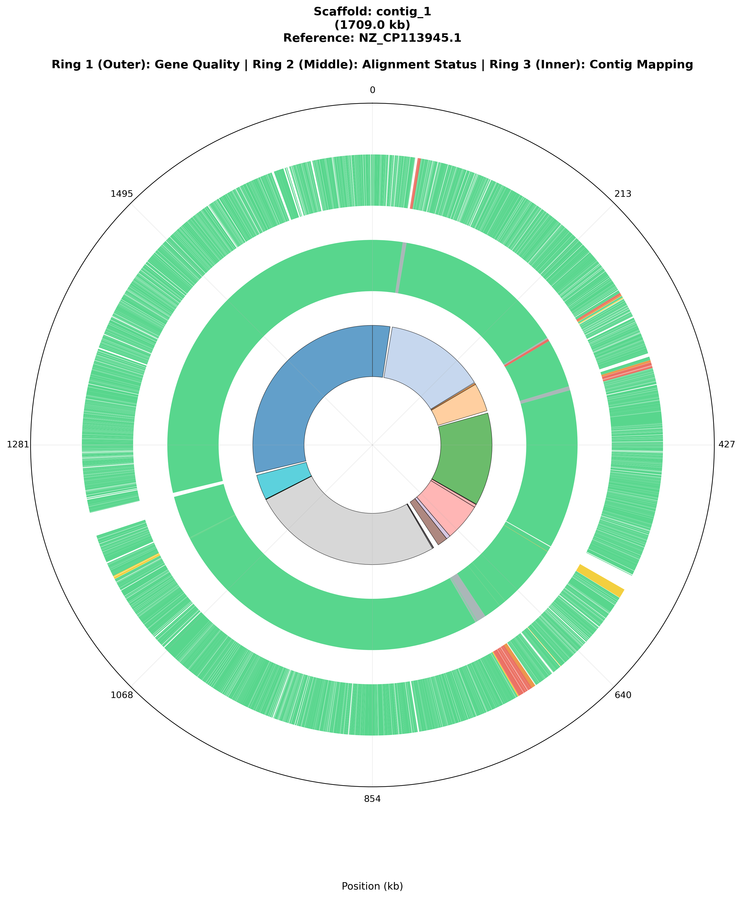
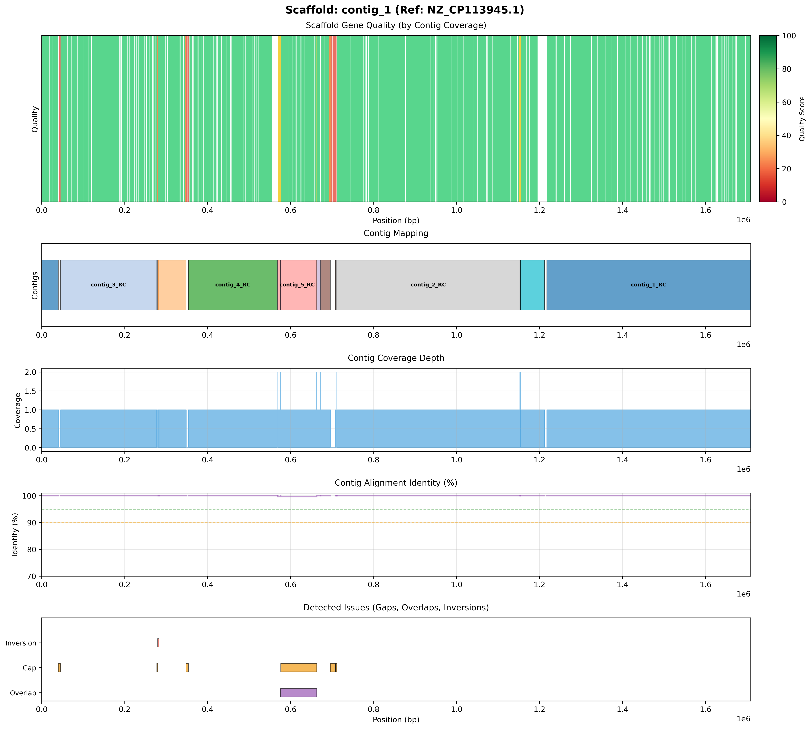

# GenomeViz

<p align="center">
  
  
  
</p>

**GenomeViz** is a comprehensive tool for visualizing and comparing bacterial genome assemblies against reference sequences. It creates beautiful circular and linear plots (both static and interactive) with comprehensive multi-track visualizations showing gene quality, alignment status, contig mapping, coverage depth, and misassemblies. It supports contig-vs-reference, scaffold-vs-reference, and scaffold-vs-contig comparison modes with automatic file detection, result caching, and HTML dashboards.

## ✨ Features

### Visualization Examples

<p align="center">
  
  <br>
  <em>Circular comparison visualization showing scaffold-contig overlap</em>
</p>

<p align="center">
  
  <br>
  <em>Linear comparison visualization with multi-track details</em>
</p>

### Three-Ring Visualization System (Circular Plots)

- **Ring 1 (Outer)**: Gene quality assessment
  - Color-coded by quality score (excellent/good/fair/poor)
  - Shows gene coverage and identity

- **Ring 2 (Middle)**: Alignment status
  - 🟢 Green: Complete coverage (1x)
  - 🟠 Orange: Duplicated regions (>1x)
  - 🔴 Red: Inverted regions (reverse strand)
  - ⚪ Gray: Missing regions (gaps)

- **Ring 3 (Inner)**: Contig mapping
  - Each contig has a unique color
  - Shows which assembly contigs align to reference

### Five-Track Visualization System (Linear Plots)

- **Track 1**: Gene quality with color-coded scores
- **Track 2**: Contig mapping showing assembly alignment
- **Track 3**: Coverage depth across the genome
- **Track 4**: Alignment identity with reference lines
- **Track 5**: Misassemblies (inversions, gaps, overlaps)

### Interactive Plots

#### Interactive Circular Plot
- **Zoom and pan** on any region
- **Hover information** for:
  - Gene names, positions, and quality scores
  - Contig names, positions, and identities
  - Alignment status and coverage
- **Export** as high-resolution images

#### Interactive Linear Plot
- **Multi-level zoom** from genome to nucleotide resolution
  - Genome level: Complete overview with all tracks
  - Gene level: Individual gene annotations visible
  - Nucleotide level: Sequence differences, SNPs, indels
- **Five comprehensive tracks**:
  - Gene quality (color-coded scores)
  - Contig mapping (assembly alignment)
  - Coverage depth (read/contig coverage)
  - Alignment identity (with reference lines)
  - Misassemblies (inversions, gaps, overlaps)
- **Range slider** for quick genome navigation
- **Smooth scroll zoom** and **click-drag pan**
- **Interactive hover** with detailed information at all levels
- **Export** to high-resolution PNG

### Additional Features

- ✅ **Scaffold-contig comparison mode** - Compare scaffolds against contigs using reference as anchor (NEW in v1.3.0)
- ✅ **Multi-mode pipeline** - Run contig, scaffold, and comparison modes in one invocation (NEW in v1.3.0)
- ✅ **Auto-detection input** - `--input` flag automatically finds reference, scaffold, and contig files (NEW in v1.3.0)
- ✅ **Result caching** - Skips reprocessing when input files are unchanged (NEW in v1.3.0)
- ✅ **HTML dashboards** - Interactive index pages linking all visualizations (NEW in v1.3.0)
- ✅ **New gene detection** - Identifies genes in scaffolds not present in contigs (NEW in v1.3.0)
- ✅ **Docker support** - Containerized execution with Nextflow compatibility (NEW in v1.3.0)
- ✅ **Origin of replication alignment** - Automatically detects and aligns visualizations to oriC
- ✅ Automatic contig orientation detection
- ✅ Static matplotlib plots for publication
- ✅ Linear plots for detailed analysis (static and interactive)
- ✅ **Clickable genes** - Click genes in interactive plots to view detailed alignment information
- ✅ **Help buttons** - Built-in help system in all interactive HTML plots
- ✅ Gene-level quality statistics (CSV export)
- ✅ Detection of gaps, inversions, and duplications
- ✅ Support for multiple sequences (chromosome + plasmids)
- ✅ **Organized output** - Separate directories per sequence with all associated files
- ✅ **Modular architecture** - Clean, maintainable codebase with separate visualizer modules
- ✅ Performance-optimized for large genomes

## 🚀 Quick Start

### Option A: Docker (recommended, all platforms)

```bash
docker pull aaronthiel/genomeviz:1.3.0

# Linux / macOS
docker run --rm -v /path/to/data:/data aaronthiel/genomeviz:1.3.0 \
  python genomeViz.py --input /data/input/ --output /data/output/ --mode all

# Windows (PowerShell)
docker run --rm -v "${PWD}\my_data:/data" aaronthiel/genomeviz:1.3.0 `
  python genomeViz.py --input /data/input/ --output /data/output/ --mode all
```

### Option B: Native (Linux / macOS / WSL)

```bash
git clone https://github.com/Aaron-Thiel/GenomeViz.git
cd GenomeViz

# Install via conda (required for mappy/minimap2)
mamba create -n genomeviz python=3.11 -c conda-forge -c bioconda mappy biopython numpy pandas matplotlib plotly kaleido -y
conda activate genomeviz
```

> **Windows note**: Native install on Windows is not supported because `mappy` requires minimap2's C library. Use Docker or WSL.

### Basic Usage

```bash
# Recommended: auto-detect files from input directory
python genomeViz.py --input input_dir/ --output results/ --mode all

# Run only contig vs reference
python genomeViz.py --input input_dir/ --output results/ --mode contig

# Manual file specification
python genomeViz.py \
  --reference ref.fna \
  --scaffold scaffolds.fna \
  --contig contigs.fna \
  --reference-gff ref.gff3 \
  --output results/ \
  --mode all
```

### Output Files

When running `--mode all`, the tool generates a structured output:

```
results/
├── index.html                                 # Root dashboard linking all modes
├── contig_alignment/                          # Contig vs reference
│   ├── index.html                            # Alignment dashboard
│   ├── NZ_CP113945.1/                        # Per-sequence directory
│   │   ├── *_circular.png                    # Static circular plot
│   │   ├── *_interactive_circular.html       # Interactive circular plot
│   │   ├── *_linear.png                      # Static linear plot
│   │   ├── *_interactive_linear.html         # Interactive linear plot
│   │   ├── *_gene_stats.csv                  # Per-gene quality statistics
│   │   └── gene_alignments/                  # Detailed gene alignment HTMLs
│   ├── contig_mapping.json
│   └── summary_report.txt
├── scaffold_alignment/                        # Scaffold vs reference (same structure)
│   └── ...
└── assembly_comparison/                       # Scaffold vs contig comparison
    ├── index.html
    ├── comparison_summary.json
    ├── {scaffold_name}/                       # Per-scaffold comparison
    │   ├── *_circular.html
    │   ├── *_circular.png
    │   ├── *_linear.png
    │   ├── *_interactive_linear.html
    │   └── gene_alignments/
    └── new_genes/                             # Novel gene analysis (if GFFs provided)
        ├── gene_comparison_report.csv
        └── visualizations/
```

**Note**: Gene alignment files are generated by default and enable the clickable gene feature in interactive plots. Use `--no-gene-alignments` to skip generation if not needed.

## 📖 Detailed Documentation

### Command-Line Options

#### Input Options

- `--input`: Input directory for automatic file detection (recommended)
- `--reference`: Reference genome in FASTA format
- `--reference-gff`: Gene annotations for reference in GFF3 format
- `--scaffold`: Scaffold assembly in FASTA format
- `--contig`: Contig assembly in FASTA format
- `--scaffold-gff`: Gene annotations for scaffolds (optional, for comparison mode)
- `--contig-gff`: Gene annotations for contigs (optional, for comparison mode)
- `--output`: Output directory for results (required)

#### Mode Selection

- `--mode`: Analysis mode
  - `contig`: Contig vs reference alignment
  - `scaffold`: Scaffold vs reference alignment
  - `comparison`: Scaffold vs contig comparison
  - `all`: Run all three modes (default when both scaffold and contig are provided)

#### Analysis Parameters

- `--preset`: Minimap2 alignment preset (`asm5`, `asm10` (default), `asm20`)
- `--min-gap`: Minimum gap size to report (default: 1000 bp)
- `--min-inversion`: Minimum inversion size to report (default: 500 bp)
- `--origin`: Manually set origin position in base pairs
  - If not specified: Auto-detects oriC from GFF annotations
  - Use `--origin 0` to disable origin rotation entirely

#### Visualization Options

- `--no-static`: Skip static PNG plots (circular and linear)
- `--no-interactive`: Skip interactive HTML plots (circular and linear)
- `--no-comparison`: Skip comparison mode visualizations
- `--no-gene-alignments`: Skip gene alignment file generation (disables gene clicking)
- `--no-auto-orient`: Skip automatic orientation detection

#### Execution Control

- `--force`: Force reprocessing, ignore cache
- `--version`: Show version number

### Understanding the Visualizations

#### Circular Plots

The circular plots provide a genome-wide overview:

1. **Gene Quality (Ring 1)**:
   - **Green** (Excellent): ≥95% quality
   - **Yellow** (Good): 85-95% quality
   - **Orange** (Fair): 70-85% quality
   - **Red** (Poor): <70% quality

2. **Alignment Status (Ring 2)**:
   - **Green**: Normal 1x coverage, correctly oriented
   - **Orange**: Duplicated regions (>1x coverage)
   - **Red**: Inverted contigs (need reverse complement)
   - **Gray**: Missing sequence (gaps in assembly)

3. **Contig Mapping (Ring 3)**:
   - Each color represents a different assembly contig
   - Shows which contigs align to each region

#### Static Linear Plots

Static linear plots show five tracks:
1. Gene-level quality
2. Coverage depth
3. Sequence identity
4. Alignment strand
5. Contig mapping

These are useful for detailed analysis of specific regions and publication figures.

#### Interactive Linear Plots

The interactive linear plots provide multi-level exploration:

**At Genome Level**:
- View entire genome in linear format
- All five tracks visible simultaneously
- Quick overview of assembly quality
- Use range slider to jump to any position

**At Gene Level** (zoom in):
- Individual genes become visible as colored blocks
- Gene names and boundaries appear
- Hover to see gene details (name, quality, coverage, identity)
- Identify problematic genes instantly

**At Nucleotide Level** (zoom in further):
- See sequence-level alignment details
- Nucleotide differences become visible
- Identify SNPs, insertions, deletions
- Compare reference vs assembly sequences directly

**Interactive Controls**:
- **Scroll** to zoom in/out smoothly
- **Drag** to pan along the genome
- **Range slider** at bottom for quick navigation
- **Hover** for context-specific information
- **Legend** to toggle tracks on/off
- **Camera icon** to export high-resolution PNG

#### Interactive Circular Plots

The interactive circular plots allow you to:
- **Zoom** by scrolling or dragging
- **Pan** by clicking and dragging
- **Hover** to see detailed information
- **Toggle** individual traces on/off
- **Export** as PNG images

### Interpreting Results

#### Quality Scores

Each gene receives a quality score (0-100) based on:
- **Coverage (30% weight)**: Percentage of gene covered by assembly
- **Identity (70% weight)**: Average sequence identity in covered regions

#### Gene Status Categories

- **Complete**: ≥95% coverage AND ≥90% identity
- **Incomplete**: 50-95% coverage
- **Divergent**: <90% identity (may indicate gene variation)
- **Missing**: <50% coverage (likely absent from assembly)

#### Common Patterns

**Pattern 1: High-Quality Assembly**
```
Ring 1: Mostly green (excellent gene quality)
Ring 2: Mostly green (complete coverage)
Ring 3: Few colors (assembled into few contigs)
```

**Pattern 2: Fragmented Assembly**
```
Ring 1: Mix of colors with gaps
Ring 2: Green + gray segments (gaps present)
Ring 3: Many colors (many small contigs)
```

**Pattern 3: Misassembled Regions**
```
Ring 1: Good overall
Ring 2: Red segments (inversions)
Ring 3: Some contigs in unusual positions
```

## 🔧 Advanced Usage

### Scaffold-Contig Comparison (NEW in v1.3.0)

Compare how scaffolding changed your assembly relative to contigs:
```bash
# With auto-detection (all GFFs in one directory)
python genomeViz.py --input input_dir/ --output results/ --mode comparison

# Manual file specification with assembly GFFs for new gene detection
python genomeViz.py \
  --reference ref.fna \
  --scaffold scaffolds.fna \
  --contig contigs.fna \
  --reference-gff ref.gff3 \
  --scaffold-gff scaffolds.gff3 \
  --contig-gff contigs.gff3 \
  --output results/ \
  --mode comparison
```

### Using Result Caching (NEW in v1.3.0)

GenomeViz caches analysis results based on input file MD5 hashes:
```bash
# First run: full analysis + static plots only
python genomeViz.py --input input_dir/ --output results/ --mode all --no-interactive

# Second run: uses cached analysis, only regenerates interactive plots
python genomeViz.py --input input_dir/ --output results/ --mode all

# Force reprocessing
python genomeViz.py --input input_dir/ --output results/ --mode all --force
```

### Controlling Origin of Replication

```bash
# Auto-detect oriC from GFF (default)
python genomeViz.py --input input_dir/ --output results/ --mode all

# Set custom origin at 150,000 bp
python genomeViz.py --input input_dir/ --output results/ --mode all --origin 150000

# Disable origin rotation
python genomeViz.py --input input_dir/ --output results/ --mode all --origin 0
```

### Docker Usage (NEW in v1.3.0)

Linux / macOS:
```bash
docker run --rm -v /path/to/data:/data aaronthiel/genomeviz:1.3.0 \
  python genomeViz.py --input /data/input/ --output /data/output/ --mode all
```

Windows (PowerShell):
```powershell
docker run --rm -v "${PWD}\my_data:/data" aaronthiel/genomeviz:1.3.0 `
  python genomeViz.py --input /data/input/ --output /data/output/ --mode all
```

### Publication-Ready Plots Only

Skip interactive HTML generation:
```bash
python genomeViz.py --input input_dir/ --output results/ --mode all --no-interactive
```

## 📊 Example Data

The `examples/input/` directory contains example bacterial genome data:

- **Reference**: ~1.9 Mbp circular chromosome with GFF3 annotations
- **Scaffolds**: Scaffold assembly with GFF3 annotations
- **Contigs**: Contig assembly with GFF3 annotations

Run the example:
```bash
python genomeViz.py --input examples/input/ --output examples/output/ --mode all
```

## 🤝 Contributing

Contributions are welcome! Please feel free to submit a Pull Request.

## 📝 Citation

If you use GenomeViz in your research, please cite:

```
This Github Page
```

## 📄 License

This project is licensed under the MIT License - see the [LICENSE](LICENSE) file for details.

## 🐛 Issues and Support

If you encounter any problems or have suggestions, please [open an issue](https://github.com/Aaron-Thiel/GenomeViz/issues).

## 📚 Dependencies

GenomeViz relies on these excellent tools:
- [minimap2/mappy](https://github.com/lh3/minimap2) - Fast sequence alignment
- [BioPython](https://biopython.org/) - Biological sequence handling
- [matplotlib](https://matplotlib.org/) - Static plotting
- [Plotly](https://plotly.com/python/) - Interactive plotting
- [NumPy](https://numpy.org/) & [Pandas](https://pandas.pydata.org/) - Data processing

## 🙏 Acknowledgments

GenomeViz was developed to make genome assembly visualization accessible to both bioinformaticians and lab biologists. Special thanks to the developers of the underlying tools that make this possible.

---

**Made with ❤️ for the genomics community**
